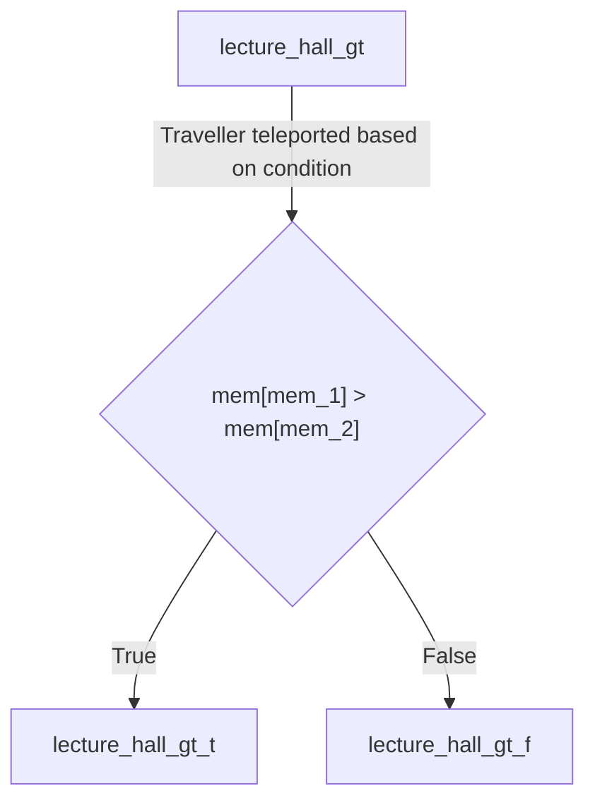
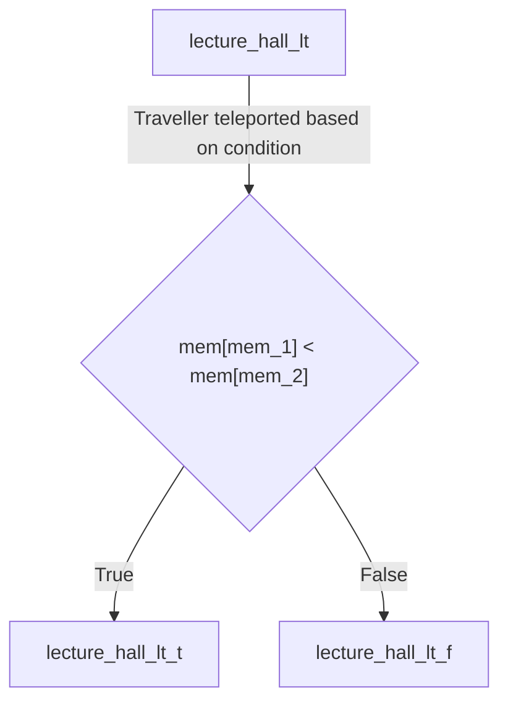
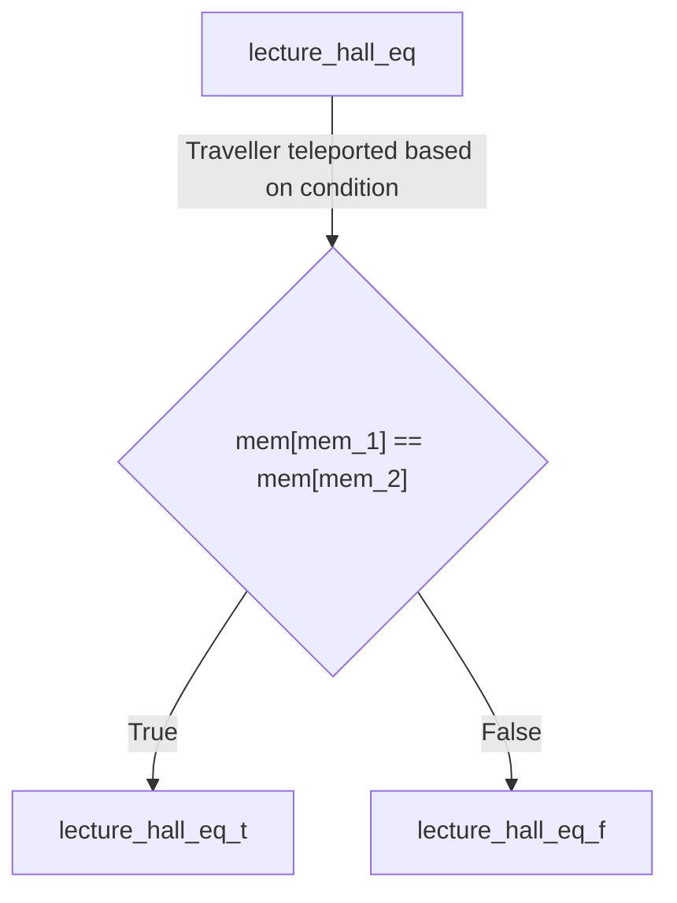
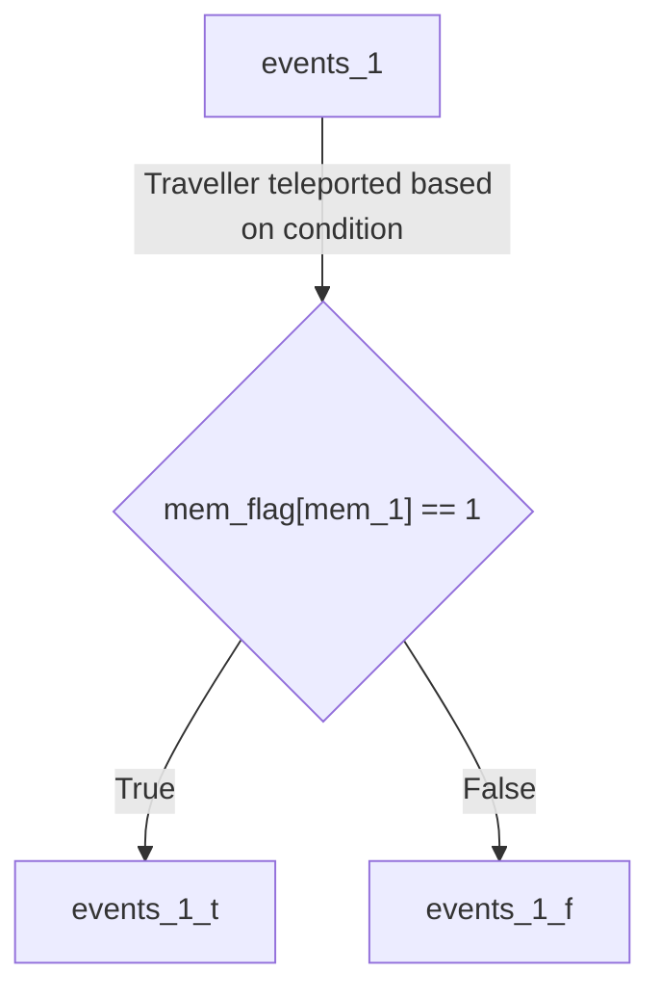

# Landmark Definitions

## iit_gate_in_1
Takes input from the console to the address in the memory tape pointed to by `mem_1`. Input is a signed 32-bit integer. Such inputs are terminated by a space or newline.

## iit_gate_in_2
Takes input from the console to the address in the memory tape pointed to by `mem_2`. Input is a signed 32-bit integer. Such inputs are terminated by a space or newline.

## hall_2
Standard addition operation. Adds the integers stored at the addresses pointed to by `mem_1` and `mem_2` and stores them at the address pointed to my `mem_3`. This operation is not valid for EOS literals.

## hall_3
Standard multiplication operation. Multiplies the integers stored at the addresses pointed to by `mem_1` and `mem_2` and stores them at the address pointed to by `mem_3`. This operation is not valid for EOS literals.

## hall_5
Standard subtraction operation. Subtracts the integers stored at the addresses pointed to by `mem_1` and `mem_2` in order (`mem[mem_1]` - `mem[mem_2]`) and stores them at the address pointed to my `mem_3`. This operation is not valid for EOS literals.

## hall_12
Standard division operation. Divides the integers stored at the addresses pointed to by `mem_1` and `mem_2` in order (`mem[mem_1]` / `mem[mem_2]`) and stores them at the address pointed to my `mem_3`. This operation is not valid for EOS literals.

## mt_1_3
Copies the value stored at the address pointed to by `mem_1` to the address pointed to by `mem_3`.

## mt_2_3
Copies the value stored at the address pointed to by `mem_2` to the address pointed to by `mem_3`.

## mt_3_1
Copies the value stored at the address pointed to by `mem_3` to the address pointed to by `mem_1`.

## mt_3_2
Copies the value stored at the address pointed to by `mem_3` to the address pointed to by `mem_2`.

## iit_gate_out_1
Prints the signed 32-bit integer value stored at the address pointed to by `mem_1` to the console. The printed number is followed by a space.

## iit_gate_out_2
Prints the signed 32-bit integer value stored at the address pointed to by `mem_2` to the console. The printed number is followed by a space.

## lecture_hall_gt

Compares the values stored at the addresses pointed to by mem_1 and mem_2. If `mem[mem_1]` > `mem[mem_2]`, then the traveller is teleported to the location lecture_hall_gt_t. Otherwise the traveller is teleported to the location lecture_hall_gt_f. These are actual landmarks and can be used in the program like any other landmark. This operation is not valid for EOS literals.

### lecture_hall_gt_t
The traveller is teleported to this location if the value stored at the address pointed to by `mem_1` is greater than the value stored at the address pointed to by `mem_2`.

### lecture_hall_gt_f
The traveller is teleported to this location if the value stored at the address pointed to by `mem_1` is less than or equal to the value stored at the address pointed to by `mem_2`.

## lecture_hall_lt

Compares the values stored at the addresses pointed to by mem_1 and mem_2. If `mem[mem_1]` < `mem[mem_2]`, then the traveller is teleported to the location lecture_hall_lt_t. Otherwise the traveller is teleported to the location lecture_hall_lt_f. These are actual landmarks and can be used in the program like any other landmark. This operation is not valid for EOS literals.

### lecture_hall_lt_t
The traveller is teleported to this location if the value stored at the address pointed to by `mem_1` is lesser than the value stored at the address pointed to by `mem_2`.

### lecture_hall_lt_f
The traveller is teleported to this location if the value stored at the address pointed to by `mem_1` is greater than or equal to the value stored at the address pointed to by `mem_2`.

## lecture_hall_eq

Compares the values stored at the addresses pointed to by mem_1 and mem_2. If `mem[mem_1]` == `mem[mem_2]`, then the traveller is teleported to the location lecture_hall_eq_t. Otherwise the traveller is teleported to the location lecture_hall_eq_f. These are actual landmarks and can be used in the program like any other landmark. This operation is not valid for EOS literals.

### lecture_hall_eq_t
The traveller is teleported to this location if the value stored at the address pointed to by `mem_1` is equal to the value stored at the address pointed to by `mem_2`.

### lecture_hall_eq_f
The traveller is teleported to this location if the value stored at the address pointed to by `mem_1` is not equal to the value stored at the address pointed to by `mem_2`.

## oat_stairs_1
Increments the value stored at the address pointed to by `mem_1` by 1. This operation is not valid for EOS literals.

## oat_stairs_2
Increments the value stored at the address pointed to by `mem_2` by 1. This operation is not valid for EOS literals.

## southern_labs_1
Decrements the value stored at the address pointed to by `mem_1` by 1. This operation is not valid for EOS literals.

## southern_labs_2
Decrements the value stored at the address pointed to by `mem_2` by 1. This operation is not valid for EOS literals.

## oat_stage / oat_stage[i]
Increments the value of the `cond` with parameter (i) passed to it. The parameter i is a signed 32-bit integer. Thus passing a negative value will indeed decrement the value of `cond`. 

{: .info}
The name of the landmark is `oat_stage`. Thus oat_stage[1] or oat_stage[2] will represent the same location and not two different locations. Moreover in the syntax of the langauge the parameter is to passed only while specifying oat_stage as the finishing landmark. When specifying oat_stage as the starting landmark it should be referenced as just **oat_stage** without any parameters. 
In short the following syntax has to be followed:  
`[Starting Landmark], [Condition Value], oat_stage[i]`  
`oat_stage, [Condition Value], [Finishing Landmark]`

## hall_13_1
Re-initializes the value stored at the address pointed to by `mem_1` to 0.

## hall_13_2
Re-initializes the value stored at the address pointed to by `mem_2` to 0.

## hall_13_3
Re-initializes the value stored at the address pointed to by `mem_3` to 0.

## hall_13_c
Re-initializes the value of the condition variable to 0.

## rm_1
Increments the address stored at `mem_1` by 1.

## rm_2
Increments the address stored at `mem_2` by 1.

## rm_3
Increments the address stored at `mem_3` by 1.

## kd_1
Decrements the address stored at `mem_1` by 1.

## kd_2
Decrements the address stored at `mem_2` by 1.

## kd_3
Decrements the address stored at `mem_3` by 1.

## eshop_1
Squares the value stored at the address pointed to by `mem_1` and stores it at the address pointed to by `mem_1`. This operation isn't valid for EOS literals.

## eshop_2
Squares the value stored at the address pointed to by `mem_2` and stores it at the address pointed to by `mem_2`. This operation isn't valid for EOS literals.  

## nankari_gate_in_1
Takes a single charcter as input and stores its ASCII value at `mem[mem_1]`. Such inputs are terminated by a space or newline.

## nankari_gate_in_2
Takes a single charcter as input and stores its ASCII value at `mem[mem_2]`. Such inputs are terminated by a space or newline.

## nankari_gate_out_1
Prints the character corresponding to the integer stored at `mem[mem_1]`. This will result in an error if the value stored at `mem[mem_1]` does not exist or is not convertible to a valid ASCII character. The printed character is followed by a space.

## nankari_gate_out_2
Prints the character corresponding to the integer stored at `mem[mem_2]`. This will result in an error if the value stored at `mem[mem_2]` does not exist or is not convertible to a valid ASCII character. The printed character is followed by a space.

## airstrip_land_1
Takes a string as input and stores the ASCII value of the ith (0 indexing) character at `mem[mem_1 + i]` ending with a special EOS character. During this operation, the value of `mem_1` does not change. Such inputs are terminated only by a newline.  
For example:  
**Input**: Hello 
**Before the operation** 
`mem_1 = 3` 
`mem[3 .. 8] = [0, 0, 0, 0, 0, 0]` 
**After the operation** 
`mem_1 = 3` 
`mem[3 .. 8] = [104, 101, 108, 108, 111, EOS]` 

## airstrip_land_2
Takes a string as input and stores the ASCII value of the ith (0 indexing) character at `mem[mem_2 + i]` ending with a special EOS character. During this operation, the value of `mem_2` does not change. Such inputs are terminated only by a newline.

## airstrip_takeoff_1
Prints a string where the ith (0 indexing) character corresponds to the ASCII value stored `mem[mem_1 + i]`. The string is formed by concating the characters corresponding to the ascii value stored at every subsequent index starting from `mem_1` till an EOS literal is encountered. During this operation, the value of `mem_1` does not change. 
For example:  
**Before the operation** 
`mem_1 = 3` 
`mem[3 .. 8] = [104, 101, 108, 108, 111, EOS]` 
**After the operation** 
`mem_1 = 3` 
`mem[3 .. 8] = [104, 101, 108, 108, 111, EOS]` 
**Output** : Hello 

## airstrip_takeoff_2
Prints a string where the ith (0 indexing) character corresponds to the ASCII value stored `mem[mem_2 + i]`. The string is formed by concating the characters corresponding to the ascii value stored at every subsequent index starting from `mem_2` till an EOS literal is encountered. During this operation, the value of `mem_2` does not change.

## pronite_1
Inserts an EOS literal at `mem[mem_1]`

## pronite_2
Inserts an EOS literal at `mem[mem_2]`

## events_1

Checks whether an EOS literal is present at `mem[mem_1]`. If the flag is set, then the traveller is teleported to the location events_1_t. Otherwise the traveller is teleported to the location events_1_f. These are actual landmarks and can be used in the program like any other landmark.

### events_1_t
The traveller is teleported to this location if the condition specified in events_1 is true.

### events_1_f
The traveller is teleported to this location if the condition specified in events_1 is false.

## events_2

Checks whether an EOS literal is present at `mem[mem_2]`. If the flag is set, then the traveller is teleported to the location events_2_t. Otherwise the traveller is teleported to the location events_2_f. These are actual landmarks and can be used in the program like any other landmark.

### events_2_t
The traveller is teleported to this location if the condition specified in events_2 is true.

### events_2_f
The traveller is teleported to this location if the condition specified in events_2 is false.
