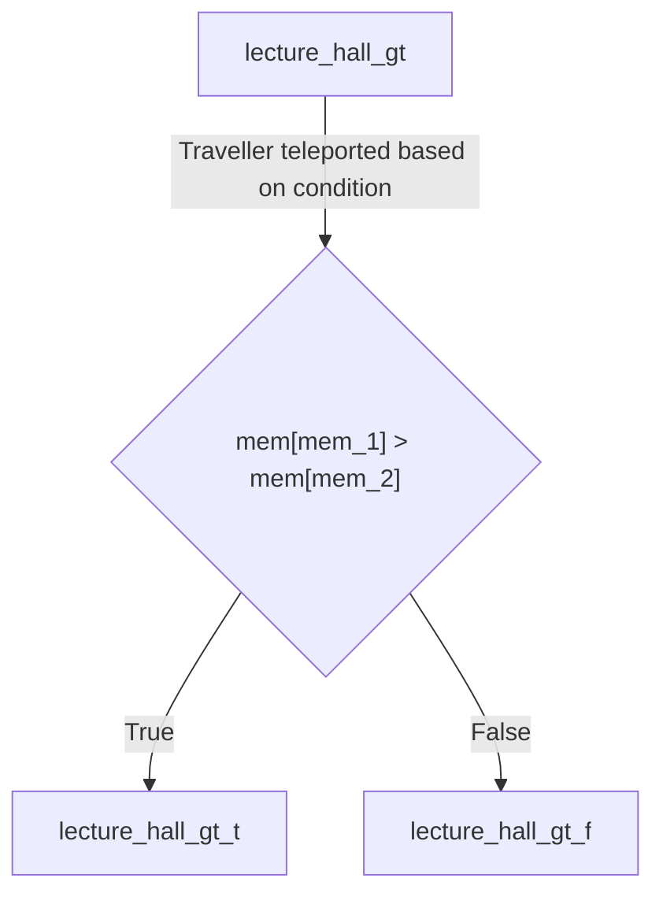
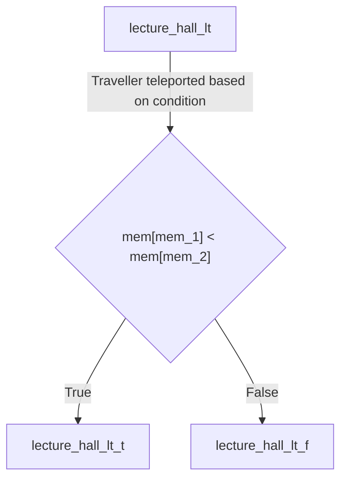
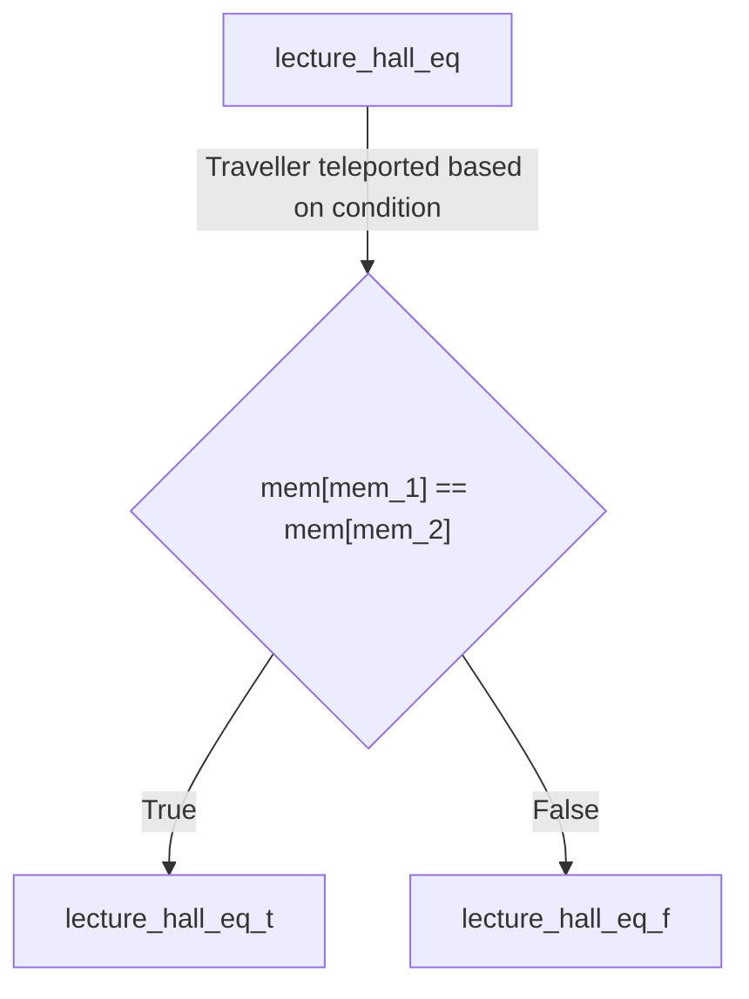
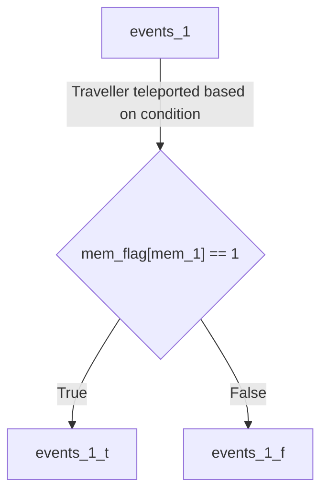

# Landmark Definitions

## iit_gate_in_1
Takes input from the console to the address in the memory tape pointed to by mem_1. Input is a signed 32-bit integer.

## iit_gate_in_2
Takes input from the console to the address in the memory tape pointed to by mem_2. Input is a signed 32-bit integer.

## hall_2
Standard addition operation. Adds the integers stored at the addresses pointed to by mem_1 and mem_2 and stores them at the address pointed to my mem_3. This operation is not valid for EOS literals.

## hall_3
Standard multiplication operation. Multiplies the integers stored at the addresses pointed to by mem_1 and mem_2 and stores them at the address pointed to my mem_3. This operation is not valid for EOS literals.

## hall_5
Standard subtraction operation. Subtracts the integers stored at the addresses pointed to by mem_1 and mem_2 in order (mem\[mem_1\] - mem\[mem_2\]) and stores them at the address pointed to my mem_3. This operation is not valid for EOS literals.

## hall_12
Standard division operation. Divides the integers stored at the addresses pointed to by mem_1 and mem_2 in order (mem\[mem_1\] / mem\[mem_2\]) and stores them at the address pointed to my mem_3. This operation is not valid for EOS literals.

## mt_1_3
Copies the value stored at the address pointed to by mem_1 to the address pointed to by mem_3.

## mt_2_3
Copies the value stored at the address pointed to by mem_2 to the address pointed to by mem_3.

## mt_3_1
Copies the value stored at the address pointed to by mem_3 to the address pointed to by mem_1.

## mt_3_2
Copies the value stored at the address pointed to by mem_3 to the address pointed to by mem_2.

## iit_gate_out_1
Prints the value stored at the address pointed to by mem_1 to the console.

## iit_gate_out_2
Prints the value stored at the address pointed to by mem_2 to the console.

## lecture_hall_gt

Compares the values stored at the addresses pointed to by mem_1 and mem_2. If mem\[mem_1\] > mem\[mem_2\], then the traveller is teleported to the location lecture_hall_gt_t. Otherwise the traveller is teleported to the location lecture_hall_gt_f. These are actual landmarks and can be used in the program like any other landmark. This operation is not valid for EOS literals.

### lecture_hall_gt_t
The traveller is teleported to this location if the value stored at the address pointed to by mem_1 is greater than the value stored at the address pointed to by mem_2.

### lecture_hall_gt_f
The traveller is teleported to this location if the value stored at the address pointed to by mem_1 is less than or equal to the value stored at the address pointed to by mem_2.

## lecture_hall_lt

Compares the values stored at the addresses pointed to by mem_1 and mem_2. If mem\[mem_1\] < mem\[mem_2\], then the traveller is teleported to the location lecture_hall_lt_t. Otherwise the traveller is teleported to the location lecture_hall_lt_f. These are actual landmarks and can be used in the program like any other landmark. This operation is not valid for EOS literals.

### lecture_hall_lt_t
The traveller is teleported to this location if the value stored at the address pointed to by mem_1 is lesser than the value stored at the address pointed to by mem_2.

### lecture_hall_lt_f
The traveller is teleported to this location if the value stored at the address pointed to by mem_1 is greater than or equal to the value stored at the address pointed to by mem_2.

## lecture_hall_eq

Compares the values stored at the addresses pointed to by mem_1 and mem_2. If mem\[mem_1\] = mem\[mem_2\], then the traveller is teleported to the location lecture_hall_eq_t. Otherwise the traveller is teleported to the location lecture_hall_eq_f. These are actual landmarks and can be used in the program like any other landmark. This operation is not valid for EOS literals.

### lecture_hall_eq_t
The traveller is teleported to this location if the value stored at the address pointed to by mem_1 is equal to the value stored at the address pointed to by mem_2.

### lecture_hall_eq_f
The traveller is teleported to this location if the value stored at the address pointed to by mem_1 is not equal to the value stored at the address pointed to by mem_2.

## oat_stairs_1
Increments the value stored at the address pointed to by mem_1 by 1. This operation is not valid for EOS literals.

## oat_stairs_2
Increments the value stored at the address pointed to by mem_2 by 1. This operation is not valid for EOS literals.

## oat_stairs_c
Increments the value of the condition variable by 1.

## southern_labs_1
Decrements the value stored at the address pointed to by mem_1 by 1. This operation is not valid for EOS literals.

## southern_labs_2
Decrements the value stored at the address pointed to by mem_2 by 1. This operation is not valid for EOS literals.

## southern_labs_c
Decrements the value of the condition variable by 1. This operation is not valid for EOS literals.

## hall_13_1
Re-initializes the value stored at the address pointed to by mem_1 to 0.

## hall_13_2
Re-initializes the value stored at the address pointed to by mem_2 to 0.

## hall_13_3
Re-initializes the value stored at the address pointed to by mem_3 to 0.

## hall_13_c
Re-initializes the value of the condition variable to 0.

## rm_1
Increments the address stored at mem_1 by 1.

## rm_2
Increments the address stored at mem_2 by 1.

## rm_3
Increments the address stored at mem_3 by 1.

## kd_1
Decrements the address stored at mem_1 by 1.

## kd_2
Decrements the address stored at mem_2 by 1.

## kd_3
Decrements the address stored at mem_3 by 1.

## eshop_1
Squares the value stored at the address pointed to by mem_1 and stores it at the address pointed to by mem_1. This operation isn't valid for EOS literals.

## eshop_2
Squares the value stored at the address pointed to by mem_2 and stores it at the address pointed to by mem_2. This operation isn't valid for EOS literals.  

## doaa_1
Prints the ASCII value of the integer stored at mem[mem_1]. This will result in an error if the value stored at mem[mem_1] does not exist or is not convertible to a valid ASCII character.

## doaa_2
Prints the ASCII value of the integer stored at mem[mem_2]. This will result in an error if the value stored at mem[mem_2] does not exist or is not convertible to a valid ASCII character.

## airstrip_land_1
This landmark takes in input of a string. Each character of the string is converted to its ASCII value and stored at the address pointed to by mem_1. The pointer mem_1 is incremented until the EOS character is encountered. The flag is set to true and 0 is stored at the address pointed to by mem_1 at the location of the EOS character.

## airstrip_land_2
This landmark takes in input of a string. Each character of the string is converted to its ASCII value and stored at the address pointed to by mem_2. The pointer mem_2 is incremented until the EOS character is encountered. The flag is set to true and 0 is stored at the address pointed to by mem_2 at the location of the EOS character.
## airstrip_takeoff_1
prints one character at a time after integer to ascii conversion of the value pointed to by mem_1. The pointer mem_1 is incremented until the flag is encountered on mem_flag[mem_1].

## airstrip_takeoff_2
prints one character at a time after integer to ascii conversion of the value pointed to by mem_2. The pointer mem_2 is incremented until the flag is encountered on mem_flag[mem_2].

## pronite_1
Sets the flag to true at the address pointed to by mem_1. It sets the value pointed to by mem_1 to 0.

## pronite_2
Sets the flag to true at the address pointed to by mem_2. It sets the value pointed to by mem_2 to 0.

{: .info}
EOS character is a special character that is used to denote the end of a string. As a normal EOS character is converted to 0 in the ASCII table, which could be difficult to distinguish from an integer 0, we have introduced the concept of string flags. A string flag is a boolean value that is set to true at the location of the EOS character. This flag is used to determine the end of a string and it can be set to true (using the pronite ground locations) at any page of the book.
## events_1

Checks if the flag is set at the address pointed to by mem_1. If the flag is set, then the traveller is teleported to the location events_1_t. Otherwise the traveller is teleported to the location events_1_f. These are actual landmarks and can be used in the program like any other landmark.

### events_1_t
The traveller is teleported to this location if the flag is set at the address pointed to by mem_1.

### events_1_f
The traveller is teleported to this location if the flag is not set at the address pointed to by mem_1.

## events_2

Checks if the flag is set at the address pointed to by mem_2. If the flag is set, then the traveller is teleported to the location events_2_t. Otherwise the traveller is teleported to the location events_2_f. These are actual landmarks and can be used in the program like any other landmark.

### events_2_t
The traveller is teleported to this location if the flag is set at the address pointed to by mem_2.

### events_2_f
The traveller is teleported to this location if the flag is not set at the address pointed to by mem_2.
